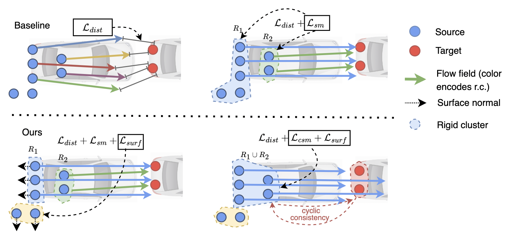

# Regularizing Self-supervised 3D Scene Flows with Surface Awareness and Cyclic Consistency

<p align="center">
  
<p>

<!-- # Results on StereoKITTI dataset  -->
<!--  -->


# Installation
- Install [Fast Geodis](https://github.com/masadcv/FastGeodis) with pip install FastGeodis --no-build-isolation
- Install [PyTorch3d](https://github.com/facebookresearch/pytorch3d) with CUDA support.
<!-- - Install [PyTorch Scatter](https://github.com/rusty1s/pytorch_scatter/tree/master) with CUDA support. -->
- Run commands in **install.sh** for installation of the packages above

# DATA
- Setup directory for extracting the data, visuals and experimental results
```console
BASE_PATH='path_where_to_store_data'
```
- Download [Data](https://login.rci.cvut.cz/data/lidar_intensity/sceneflow/data_sceneflow.tgz) and unpack it to the folder **$BASE_PATH/data/sceneflow**:

```console
tar -xvf data_sceneflow.tgz $BASE_PATH/data/sceneflow
```

# Run Experiments
To run the method on all datasets with final metrics printed on **cuda:0**, just type:
```console
for i in {0..6}; do python evaluate_flow.py $i; done
```
where the argument sets the specific datasets according to the following table:
| Dataset       | Argument Number | Model |
|--------------|-----------|-----------|
| KITTI t | 0 | Neural Prior|
| StereoKITTI | 1 | Neural Prior |
| KITTI  t | 2 | SCOOP |
| StereoKITTI | 3 | SCOOP |
| Argoverse | 4 | Neural Prior |
| Nuscenes | 5 | Neural Prior |
| Waymo | 6 | Neural Prior |

# Experimental results on LiDAR Datasets

<!--  -->


<p align="center">
  
</p>

# Experimental results on StereoKITTI Dataset

<p align="center">
  
</p>


# Qualitative Example
